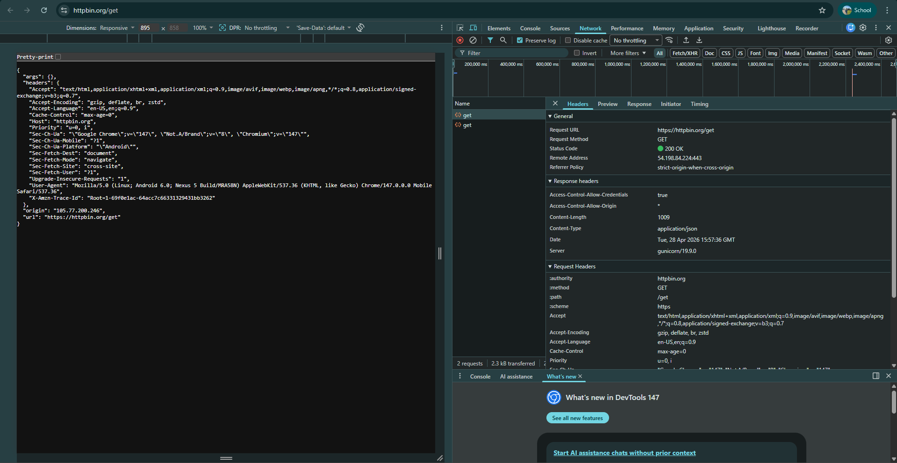
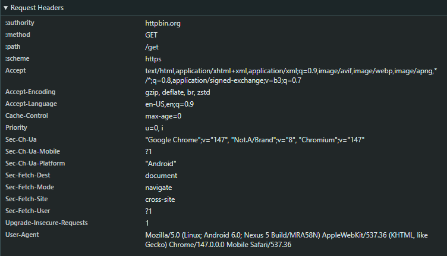
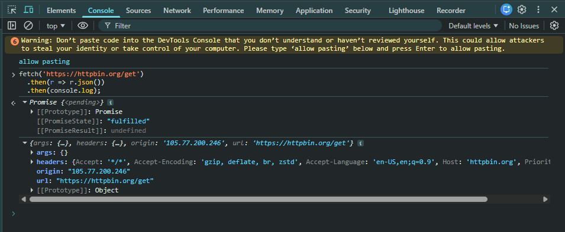
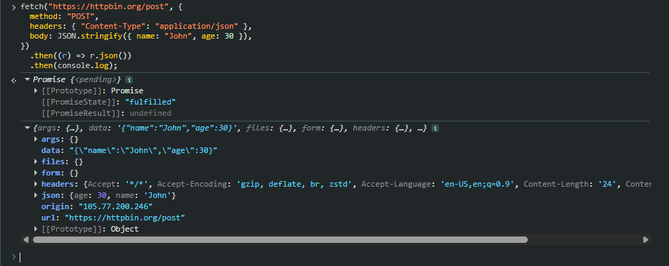
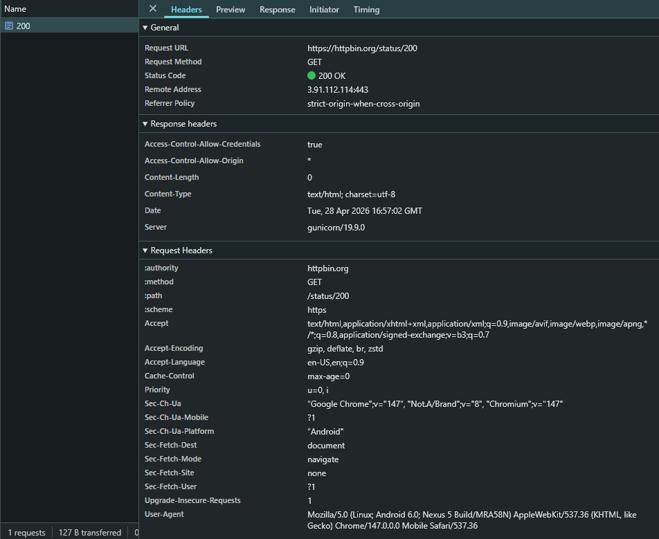
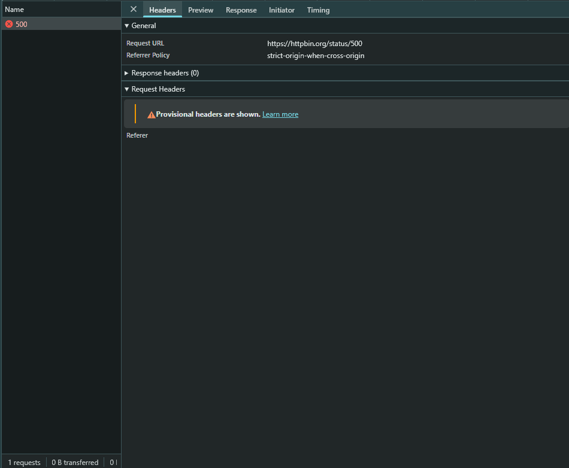
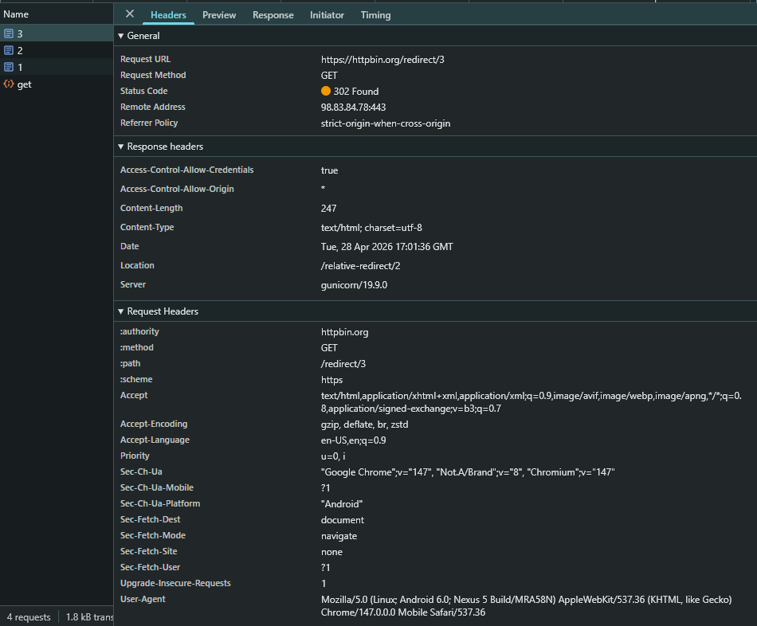

# TP 1 : Exploration avec les DevTools

## Objectifs

- Analyser les requêtes/réponses HTTP
- Comprendre les headers
- Observer les codes de statut

---

## 1.1 Ouvrir les DevTools

- Ouvrez Chrome ou Firefox
- Appuyez sur **F12** ou **Ctrl + Shift + I**
- Allez dans l'onglet **Network (Réseau)**

**Capture d'écran :**  


---

## 1.2 Observer une requête simple

- Cochez **"Preserve log"** pour garder l'historique
- Naviguez vers : https://httpbin.org/get
- Cliquez sur la requête dans la liste

### Questions

- **Quel est le code de statut ?**  
  200

- **Quels headers de requête sont envoyés ?**  
  

- **Quel est le Content-Type de la réponse ?**  
  application/json

---

## 1.3 Tester différentes méthodes

### GET

```javascript
fetch("https://httpbin.org/get")
  .then((r) => r.json())
  .then(console.log);
```

**Capture d'écran :**


```javascript
fetch("https://httpbin.org/post", {
  method: "POST",
  headers: { "Content-Type": "application/json" },
  body: JSON.stringify({ name: "John", age: 30 }),
})
  .then((r) => r.json())
  .then(console.log);
```

**Capture d'écran :**


---

## 1.4 Observer les codes de statut

Testez ces URLs :

- https://httpbin.org/status/200
- https://httpbin.org/status/404
- https://httpbin.org/status/500
- https://httpbin.org/redirect/300

### Résultats

**200 :**  
Code de statut : `200 OK`  
**Capture d'écran :**  


**404 :**  
Code de statut : `404 NOT FOUND`
**Capture d'écran :**  


**500 :**  
Code de statut : `500 INTERNAL SERVER ERROR`  
**Capture d'écran :**  


**redirect/3 :**  
La requête effectue 3 redirections :

1. `302 FOUND` vers `/relative-redirect/2`
2. `302 FOUND` vers `/relative-redirect/1`
3. `302 FOUND` vers `/get`

Réponse finale : `200 OK` avec un corps JSON.

**Capture d'écran :**


## Exercice

Remplissez le tableau :

| URL                    | Méthode | Code | Content-Type             |
| ---------------------- | ------- | ---- | ------------------------ |
| httpbin.org/get        | GET     | 200  | application/json         |
| httpbin.org/post       | POST    | 405  | text/html                |
| httpbin.org/status/201 | GET     | 201  | text/html; charset=utf-8 |

