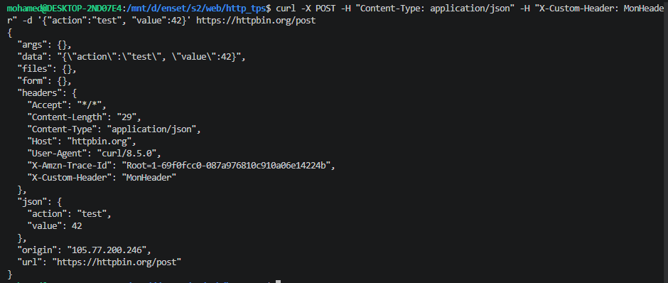

# TP 2 : Maîtrise de cURL

## Objectifs

- Utiliser cURL en ligne de commande
- Comprendre les options principales
- Envoyer différents types de requêtes

---

## Prérequis

- Terminal Linux/macOS ou Git Bash sous Windows
- cURL installé

Vérification :

```bash
curl --version
```

**Résultat :**

```text
curl 8.5.0 (x86_64-pc-linux-gnu) libcurl/8.5.0 OpenSSL/3.0.13 zlib/1.3 brotli/1.1.0 zstd/1.5.5 libidn2/2.3.7 libpsl/0.21.2 (+libidn2/2.3.7) libssh/0.10.6/openssl/zlib nghttp2/1.59.0 librtmp/2.3 OpenLDAP/2.6.7
Release-Date: 2023-12-06, security patched: 8.5.0-2ubuntu10.8
Protocols: dict file ftp ftps gopher gophers http https imap imaps ldap ldaps mqtt pop3 pop3s rtmp rtsp scp sftp smb smbs smtp smtps telnet tftp
Features: alt-svc AsynchDNS brotli GSS-API HSTS HTTP2 HTTPS-proxy IDN IPv6 Kerberos Largefile libz NTLM PSL SPNEGO SSL threadsafe TLS-SRP UnixSockets zstd
```

---

## Exercices

## 2.1 Requête GET simple

### Requête basique

```bash
curl https://httpbin.org/get
```

**Résultat :**

```json
{
  "args": {},
  "headers": {
    "Accept": "*/*",
    "Host": "httpbin.org",
    "User-Agent": "curl/8.5.0",
    "X-Amzn-Trace-Id": "Root=1-69f0ebf1-3c45f6b667c04a0111a67218"
  },
  "origin": "105.77.200.246",
  "url": "https://httpbin.org/get"
}
```

### Avec headers de réponse

```bash
curl -i https://httpbin.org/get
```

**Résultat :**

```text
HTTP/2 200
date: Tue, 28 Apr 2026 18:17:53 GMT
content-type: application/json
content-length: 255
server: gunicorn/19.9.0
access-control-allow-origin: *
access-control-allow-credentials: true

{
  "args": {},
  "headers": {
    "Accept": "*/*",
    "Host": "httpbin.org",
    "User-Agent": "curl/8.5.0",
    "X-Amzn-Trace-Id": "Root=1-69f0f9d1-32639ef95791c12a2ccdf72a"
  },
  "origin": "105.77.200.246",
  "url": "https://httpbin.org/get"
}
```

### Mode verbose

```bash
curl -v https://httpbin.org/get
```

**Résultat :**

```text
* Host httpbin.org:443 was resolved.
* IPv6: 2c0f:fa18:0:10::3e4:4c34, 2c0f:fa18:0:10::6253:544e, 2c0f:fa18:0:10::2cc7:b305, 2c0f:fa18:0:10::3ea:c750, 2c0f:fa18:0:10::36c6:54e0, 2c0f:fa18:0:10::3449:1e48, 2c0f:fa18:0:10::6254:5704, 2c0f:fa18:0:10::35b:7072
* IPv4: 98.84.87.4, 52.73.30.72, 3.228.76.52, 3.91.112.114, 54.198.84.224, 98.83.84.78, 44.199.179.5, 3.234.199.80
*   Trying 98.84.87.4:443...
* Connected to httpbin.org (98.84.87.4) port 443
* ALPN: curl offers h2,http/1.1
* TLSv1.3 (OUT), TLS handshake, Client hello (1):
*  CAfile: /etc/ssl/certs/ca-certificates.crt
*  CApath: /etc/ssl/certs
* TLSv1.3 (IN), TLS handshake, Server hello (2):
* TLSv1.2 (IN), TLS handshake, Certificate (11):
* TLSv1.2 (IN), TLS handshake, Server key exchange (12):
* TLSv1.2 (IN), TLS handshake, Server finished (14):
* TLSv1.2 (OUT), TLS handshake, Client key exchange (16):
* TLSv1.2 (OUT), TLS change cipher, Change cipher spec (1):
* TLSv1.2 (OUT), TLS handshake, Finished (20):
* TLSv1.2 (IN), TLS handshake, Finished (20):
* SSL connection using TLSv1.2 / ECDHE-RSA-AES128-GCM-SHA256 / prime256v1 / rsaEncryption
* ALPN: server accepted h2
* Server certificate:
*  subject: CN=httpbin.org
*  start date: Jul 20 00:00:00 2025 GMT
*  expire date: Aug 17 23:59:59 2026 GMT
*  subjectAltName: host "httpbin.org" matched cert's "httpbin.org"
*  issuer: C=US; O=Amazon; CN=Amazon RSA 2048 M03
*  SSL certificate verify ok.
*   Certificate level 0: Public key type RSA (2048/112 Bits/secBits), signed using sha256WithRSAEncryption
*   Certificate level 1: Public key type RSA (2048/112 Bits/secBits), signed using sha256WithRSAEncryption
*   Certificate level 2: Public key type RSA (2048/112 Bits/secBits), signed using sha256WithRSAEncryption
* using HTTP/2
* [HTTP/2] [1] OPENED stream for https://httpbin.org/get
* [HTTP/2] [1] [:method: GET]
* [HTTP/2] [1] [:scheme: https]
* [HTTP/2] [1] [:authority: httpbin.org]
* [HTTP/2] [1] [:path: /get]
* [HTTP/2] [1] [user-agent: curl/8.5.0]
* [HTTP/2] [1] [accept: */*]
> GET /get HTTP/2
> Host: httpbin.org
> User-Agent: curl/8.5.0
> Accept: */*
>
< HTTP/2 200
< date: Tue, 28 Apr 2026 18:18:17 GMT
< content-type: application/json
< content-length: 255
< server: gunicorn/19.9.0
< access-control-allow-origin: *
< access-control-allow-credentials: true
<
{
  "args": {},
  "headers": {
    "Accept": "*/*",
    "Host": "httpbin.org",
    "User-Agent": "curl/8.5.0",
    "X-Amzn-Trace-Id": "Root=1-69f0f9e9-29e80e66265441de5da29f6b"
  },
  "origin": "105.77.200.246",
  "url": "https://httpbin.org/get"
}
* Connection #0 to host httpbin.org left intact
```

### Question

Quelle est la différence entre `-i` et `-v` ?

**Réponse :**

---

## 2.2 Requête POST avec données

### Form data

```bash
curl -X POST -d "name=John&email=john@example.com" \
  https://httpbin.org/post
```

**Résultat :**

```json
{
  "args": {},
  "data": "",
  "files": {},
  "form": {
    "email": "john@example.com",
    "name": "John"
  },
  "headers": {
    "Accept": "*/*",
    "Content-Length": "32",
    "Content-Type": "application/x-www-form-urlencoded",
    "Host": "httpbin.org",
    "User-Agent": "curl/8.5.0",
    "X-Amzn-Trace-Id": "Root=1-69f0fa1e-794a4adf19480084549dabde"
  },
  "json": null,
  "origin": "105.77.200.246",
  "url": "https://httpbin.org/post"
}
```

### JSON

```bash
curl -X POST \
  -H "Content-Type: application/json" \
  -d '{"name": "John", "email": "john@example.com"}' \
  https://httpbin.org/post
```

**Résultat :**

```json
{
  "args": {},
  "data": "{\"name\": \"John\", \"email\": \"john@example.com\"}",
  "files": {},
  "form": {},
  "headers": {
    "Accept": "*/*",
    "Content-Length": "45",
    "Content-Type": "application/json",
    "Host": "httpbin.org",
    "User-Agent": "curl/8.5.0",
    "X-Amzn-Trace-Id": "Root=1-69f0fa2d-1cf79aad26097f643ab13ec6"
  },
  "json": {
    "email": "john@example.com",
    "name": "John"
  },
  "origin": "105.77.200.246",
  "url": "https://httpbin.org/post"
}
```

---

## 2.3 Headers personnalisés

```bash
curl -H "Authorization: Bearer mon-token-secret" \
  -H "Accept: application/json" \
  https://httpbin.org/headers
```

**Résultat :**

```json
{
  "headers": {
    "Accept": "application/json",
    "Authorization": "Bearer mon-token-secret",
    "Host": "httpbin.org",
    "User-Agent": "curl/8.5.0",
    "X-Amzn-Trace-Id": "Root=1-69f0fa72-78c087604810aff521e0f9ed"
  }
}
```

---

## 2.4 Suivre les redirections

### Sans `-L`

```bash
curl https://httpbin.org/redirect/3
```

**Résultat :**

```html
<!DOCTYPE html PUBLIC "-//W3C//DTD HTML 3.2 Final//EN">
<title>Redirecting...</title>
<h1>Redirecting...</h1>
<p>
  You should be redirected automatically to target URL:
  <a href="/relative-redirect/2">/relative-redirect/2</a>. If not click the
  link.
</p>
```

### Avec `-L`

```bash
curl -L https://httpbin.org/redirect/3
```

**Résultat :**

```json
{
  "args": {},
  "headers": {
    "Accept": "*/*",
    "Host": "httpbin.org",
    "User-Agent": "curl/8.5.0",
    "X-Amzn-Trace-Id": "Root=1-69f0fab9-07beb10e724720c270c3fdc0"
  },
  "origin": "105.77.200.246",
  "url": "https://httpbin.org/get"
}
```

---

## 2.5 Télécharger un fichier

### Sauvegarder la sortie

```bash
curl -o image.png https://httpbin.org/image/png
```

**Résultat :**

```text
  % Total    % Received % Xferd  Average Speed   Time    Time     Time  Current
                                 Dload  Upload   Total   Spent    Left  Speed
100  8090  100  8090    0     0  12174      0 --:--:-- --:--:-- --:--:-- 12165
```

**Image :**


### Garder le nom original

```bash
curl -O https://example.com/fichier.pdf
```

**Résultat :**

```text
  % Total    % Received % Xferd  Average Speed   Time    Time     Time  Current
                                 Dload  Upload   Total   Spent    Left  Speed
100   528    0   528    0     0   3333      0 --:--:-- --:--:-- --:--:--  3320
```

**pdf :**

[Click to open PDF](fichier.pdf)

---

## Exercice avancé

Écrivez une commande cURL qui :

- Envoie une requête POST à https://httpbin.org/post
- Avec le header `Content-Type: application/json`
- Avec le header `X-Custom-Header: MonHeader`
- Avec le body `{"action": "test", "value": 42}`
- Affiche les headers de réponse

**Commande :**

```bash
curl -X POST -H "Content-Type: application/json" -H "X-Custom-Header: MonHeader" -d '{"action":"test","value":42}' https://httpbin.org/post
```

**Résultat :**

```json
{
  "args": {},
  "data": "{\"action\":\"test\", \"value\":42}",
  "files": {},
  "form": {},
  "headers": {
    "Accept": "*/*",
    "Content-Length": "29",
    "Content-Type": "application/json",
    "Host": "httpbin.org",
    "User-Agent": "curl/8.5.0",
    "X-Amzn-Trace-Id": "Root=1-69f0fcc0-087a976810c910a06e14224b",
    "X-Custom-Header": "MonHeader"
  },
  "json": {
    "action": "test",
    "value": 42
  },
  "origin": "105.77.200.246",
  "url": "https://httpbin.org/post"
}
```

**Capture d'écran :**


