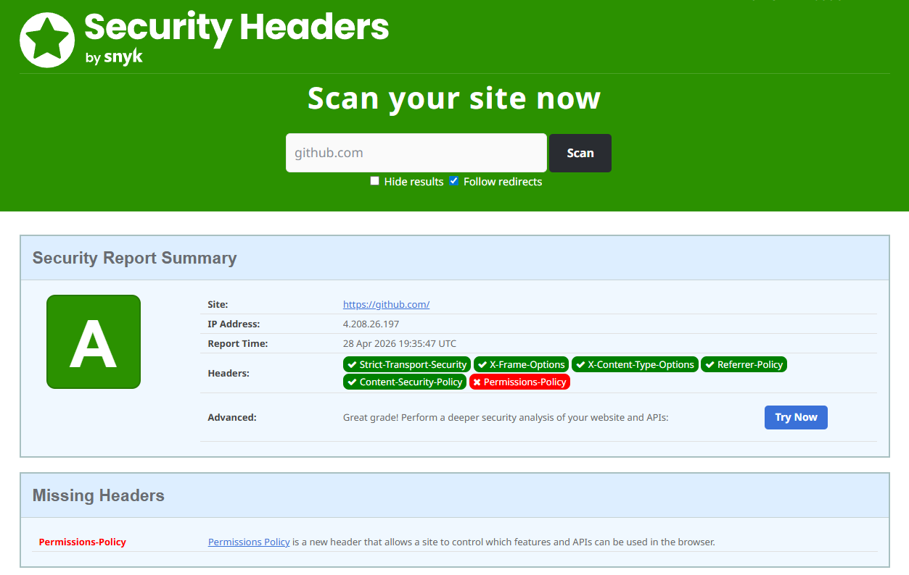

# TP 4 : Analyse des Headers de Sécurité

## Objectifs

- Comprendre les headers de sécurité
- Analyser la configuration d'un site
- Identifier les améliorations possibles

---

## Étapes

## 4.1 Vérifier les headers d'un site

### Voir tous les headers

```bash
curl -I https://google.com
```

**Résultat :**

```text
HTTP/2 301
location: https://www.google.com/
content-type: text/html; charset=UTF-8
content-security-policy-report-only: object-src 'none';base-uri 'self';script-src 'nonce-KiNWiF_elnaupNEp-SFLTA' 'strict-dynamic' 'report-sample' 'unsafe-eval' 'unsafe-inline' https: http:;report-uri https://csp.withgoogle.com/csp/gws/other-hp
date: Tue, 28 Apr 2026 19:34:42 GMT
expires: Thu, 28 May 2026 19:34:42 GMT
cache-control: public, max-age=2592000
server: gws
content-length: 220
x-xss-protection: 0
x-frame-options: SAMEORIGIN
alt-svc: h3=":443"; ma=2592000,h3-29=":443"; ma=2592000
```

### Chercher les headers de sécurité importants

```bash
curl -s -D - https://github.com -o /dev/null | grep -i "strict\|x-frame\|x-content\|content-security"
```

**Résultat :**

```text
strict-transport-security: max-age=31536000; includeSubdomains; preload
x-frame-options: deny
x-content-type-options: nosniff
referrer-policy: origin-when-cross-origin, strict-origin-when-cross-origin
content-security-policy: default-src 'none'; base-uri 'self'; child-src github.githubassets.com github.com/assets-cdn/worker/ github.com/assets/ gist.github.com/assets-cdn/worker/; connect-src 'self' uploads.github.com www.githubstatus.com collector.github.com raw.githubusercontent.com api.github.com github-cloud.s3.amazonaws.com github-production-repository-file-5c1aeb.s3.amazonaws.com github-production-upload-manifest-file-7fdce7.s3.amazonaws.com github-production-user-asset-6210df.s3.amazonaws.com *.rel.tunnels.api.visualstudio.com wss://*.rel.tunnels.api.visualstudio.com github.githubassets.com objects-origin.githubusercontent.com copilot-proxy.githubusercontent.com proxy.individual.githubcopilot.com proxy.business.githubcopilot.com proxy.enterprise.githubcopilot.com *.actions.githubusercontent.com wss://*.actions.githubusercontent.com productionresultssa0.blob.core.windows.net productionresultssa1.blob.core.windows.net productionresultssa2.blob.core.windows.net productionresultssa3.blob.core.windows.net productionresultssa4.blob.core.windows.net productionresultssa5.blob.core.windows.net productionresultssa6.blob.core.windows.net productionresultssa7.blob.core.windows.net productionresultssa8.blob.core.windows.net productionresultssa9.blob.core.windows.net productionresultssa10.blob.core.windows.net productionresultssa11.blob.core.windows.net productionresultssa12.blob.core.windows.net productionresultssa13.blob.core.windows.net productionresultssa14.blob.core.windows.net productionresultssa15.blob.core.windows.net productionresultssa16.blob.core.windows.net productionresultssa17.blob.core.windows.net productionresultssa18.blob.core.windows.net productionresultssa19.blob.core.windows.net github-production-repository-image-32fea6.s3.amazonaws.com github-production-release-asset-2e65be.s3.amazonaws.com insights.github.com wss://alive.github.com wss://alive-staging.github.com api.githubcopilot.com api.individual.githubcopilot.com api.business.githubcopilot.com api.enterprise.githubcopilot.com edge.fullstory.com rs.fullstory.com; font-src github.githubassets.com; form-action 'self' github.com gist.github.com copilot-workspace.githubnext.com objects-origin.githubusercontent.com; frame-ancestors 'none'; frame-src viewscreen.githubusercontent.com notebooks.githubusercontent.com www.youtube-nocookie.com; img-src 'self' data: blob: github.githubassets.com media.githubusercontent.com camo.githubusercontent.com identicons.github.com avatars.githubusercontent.com private-avatars.githubusercontent.com github-cloud.s3.amazonaws.com objects.githubusercontent.com release-assets.githubusercontent.com secured-user-images.githubusercontent.com user-images.githubusercontent.com private-user-images.githubusercontent.com opengraph.githubassets.com marketplace-screenshots.githubusercontent.com copilotprodattachments.blob.core.windows.net/github-production-copilot-attachments/ github-production-user-asset-6210df.s3.amazonaws.com customer-stories-feed.github.com spotlights-feed.github.com objects-origin.githubusercontent.com *.githubusercontent.com images.ctfassets.net/8aevphvgewt8/; manifest-src 'self'; media-src github.com user-images.githubusercontent.com secured-user-images.githubusercontent.com private-user-images.githubusercontent.com github-production-user-asset-6210df.s3.amazonaws.com gist.github.com github.githubassets.com assets.ctfassets.net/8aevphvgewt8/ videos.ctfassets.net/8aevphvgewt8/; script-src github.githubassets.com; style-src 'unsafe-inline' github.githubassets.com; upgrade-insecure-requests; worker-src github.githubassets.com github.com/assets-cdn/worker/ github.com/assets/ gist.github.com/assets-cdn/worker/
```

---

## 4.2 Analyser avec Security Headers

1. Allez sur https://securityheaders.com
2. Entrez l'URL d'un site, par exemple `github.com`
3. Analysez le rapport

**Capture d'écran :**



---

## Headers à vérifier

| Header                      | But                  | Valeur recommandée                    |
| --------------------------- | -------------------- | ------------------------------------- |
| `Strict-Transport-Security` | Forcer HTTPS         | `max-age=31536000; includeSubDomains` |
| `X-Frame-Options`           | Anti-clickjacking    | `DENY` ou `SAMEORIGIN`                |
| `X-Content-Type-Options`    | Anti-MIME sniffing   | `nosniff`                             |
| `Content-Security-Policy`   | Sources autorisées   | `default-src 'self'`                  |
| `Referrer-Policy`           | Contrôle du referrer | `strict-origin-when-cross-origin`     |

---

## Exercice

Analysez 3 sites de votre choix et remplissez le tableau :

| Site        | HSTS                                         | X-Frame        | CSP                 | Note           |
| ----------- | -------------------------------------------- | -------------- | ------------------- | -------------- |
| github.com  | max-age=31536000; includeSubdomains; preload | deny           | default-src 'none'; | Bonne sécurité |
| google.com  | max-age=31536000                             | SAMEORIGIN     | object-src 'none';  | Bonne sécurité |
| chatgpt.com | max-age=31536000; includeSubDomains; preload | Header not set | default-src 'self'; | Bonne sécurité |
